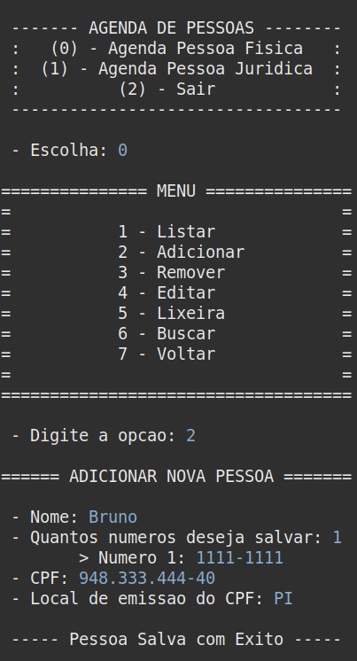
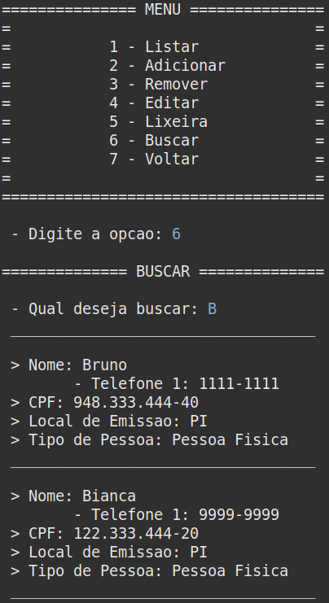

<h1 align="center">
    Agenda Telefônica 
    Avaliação 1 de Programação II 
    UESPI - Universidade Estadual do Piauí
</h1>

## 📕 Agenda Telefônica

O objetivo com este projeto é fazer uma agenda telefônica, utilizando boas práticas do uso da orientação a objetos. As seguintes informações foram passadas para a construção do projeto:

    a) A classe Agenda é a classe principal do sistema e contém o método main.
    b) Toda a comunicação com o usuário (coleta de dados) será feita pelas classes do pacote controle.
    c) As classes do pacote modelo representam as informações que o software irá manipular.
    d) A classe de BaseDeDados contém um mapa que armazenará todos os contatos.
    e) A letra inicial é chave para uma lista de contatos que tem o nome iniciados com aquela letra.

## 📁 Projeto
### 📍 Fazendo o clone do repositório:

    git clone https://github.com/brunnuscz/agenda-telefonica.git

### 📍 Você pode utilizar a IDE chamada Eclipse para rodar o projeto:

    https://www.eclipse.org/downloads/
    
### 📍 Lembre de instalar o JDK na sua máquina:

    https://www.oracle.com/br/java/technologies/downloads/

## 🗃 Estrutura do projeto

    ├── src
    │ ├── controller
    │ │ └── AgendaPessoaFisica.java
    │ │ └── AgendaPessoaJuridica.java
    │ │ └── DAO.java
    │ │ └── PessoaDAO.java
    │ │ └── PessoaFisicaDAO.java
    │ │ └── PessoaJuridicaDAO.java
    │ ├── model
    │ │ └── BD.java
    │ │ └── Cnpj.java
    │ │ └── Cpf.java
    │ │ └── Documento.java
    │ │ └── Operacao.java
    │ │ └── Pessoa.java
    │ │ └── PessoaFisica.java
    │ │ └── PessoaFisicaBd.java
    │ │ └── PessoaJuridica.java
    │ │ └── PessoaJuridicaBd.java
    │ │ └── Telefone.java
    │ ├── view
    │ │ └── Agenda.java
    │ │ └── InterfaceUsuario.java
    └───└── Main.java
    
## 🚩 Prévia

    
    

